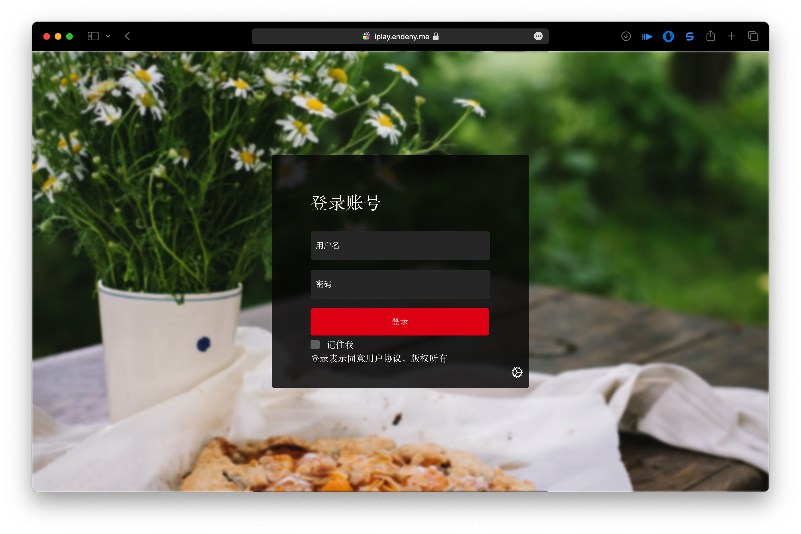
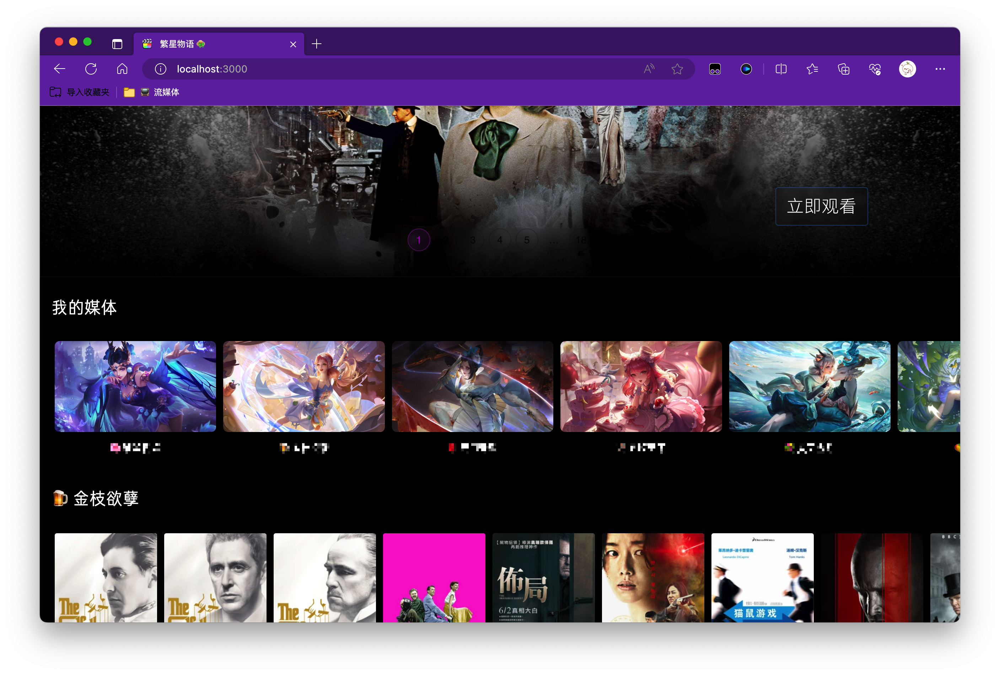
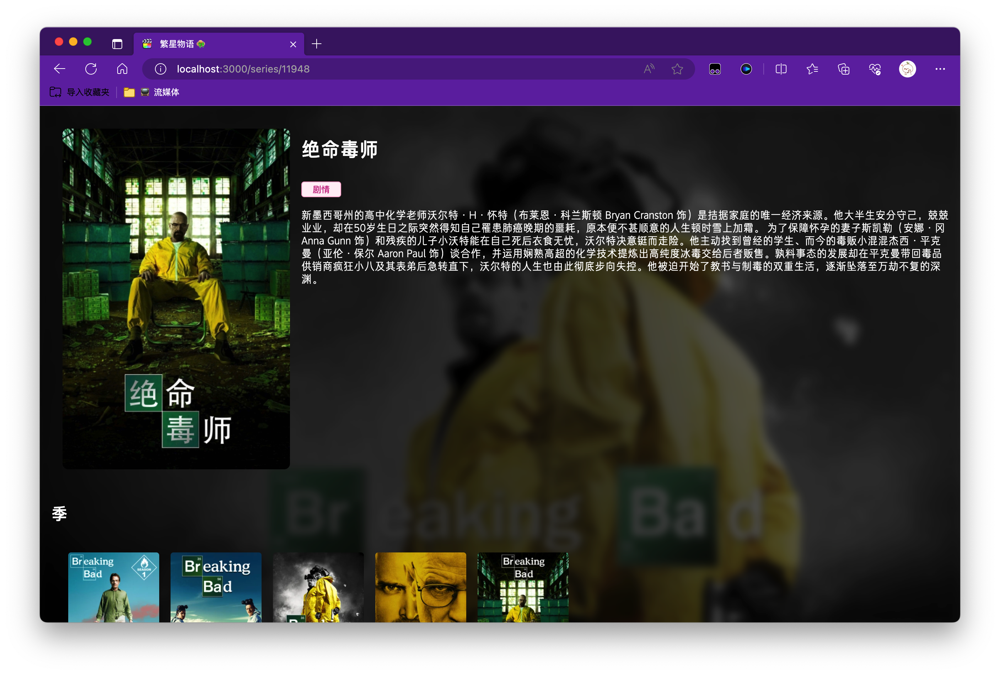

# 流媒体网站

由于emby不支持更换主题，所以有了这个项目

## 开始使用

点击登录页面右下角⚙️, 填写emby服务器相关信息，然后点击登录即可

## 用户界面

||||
|:-:|:-:|:-:|
||||
||||
## 主要功能

- 支持emby
- 支持多个emby站点切换
- 可以定制主题
- 可以播放视频
- 支持外部播放器调用

## 项目进展

目前处于早期阶段，用户界面还不完善

## 部署

直接下载项目的`gh-pages`分支代码即可

## 开发

在项目根目录执行`npm install`安装依赖，然后`npm run start`即可运行程序