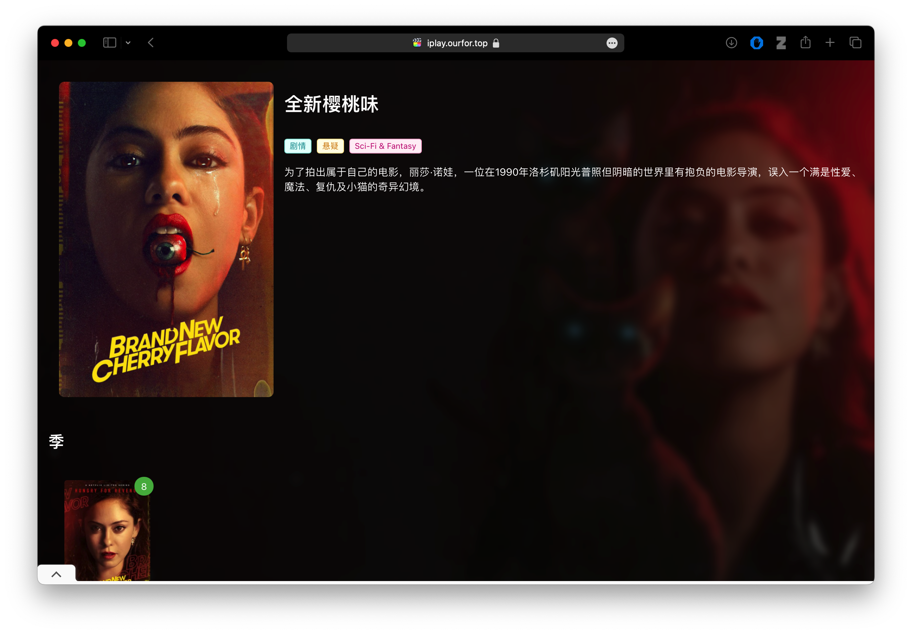

# 前言

一个简单、开源的视频点播平台，适配多种媒体服务器数据源。

## 使用

目前已经适配Emby数据源, 点击登录页面右下角⚙️, 填写emby服务器相关信息，然后点击登录即可

## 界面

||||
|-|-|-|
||||
||||

## 功能

- 支持emby数据源
- 支持多个emby站点切换
- 可以定制主题
- 可以播放视频
- 支持调用外部播放器播放
- 支持影片留言评论，[配置文档](./doc/comment.md)
- 支持配置Adsense广告
- 支持TMDB查询影片信息
- 支持游客访问
- 支持搭建演示站点，[搭建文档](./doc/demo.md)

## 进度

业余时间开发，刚需可提issue

Todo:

- [ ] 完善用户界面交互
- [ ] 资源搜索功能
- [ ] 完善站点配置功能 

## 部署

直接下载项目的`gh-pages`分支代码即可

## 开发

在项目根目录执行`npm install`安装依赖，然后`npm run start`即可运行程序

## 交流

[GitHub Discussions]( https://github.com/ourfor/iplay/discussions)
