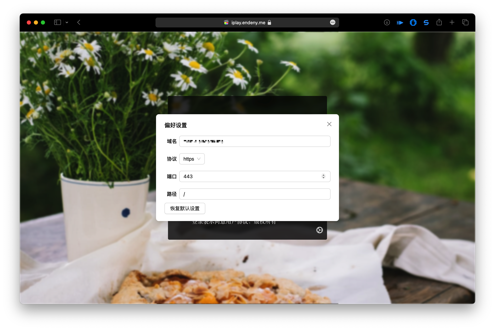

# 前言

一个简单、开源的视频管理平台，适配多种媒体服务器数据源

## 使用

目前已经适配Emby数据源, 点击登录页面右下角⚙️, 填写emby服务器相关信息，然后点击登录即可

## 界面

||||
|:-:|:-:|:-:|
||||
||||

## 功能

- 支持emby数据源
- 支持多个emby站点切换
- 可以定制主题
- 可以播放视频
- 支持外部播放器调用

## 进度

学业繁重，业余时间开发，刚需可提issue

Todo:

- [ ] 完善用户界面交互
- [ ] 支持调用外部播放器
- [ ] 支持调用外部接口查询未知电影或剧集

## 部署

直接下载项目的`gh-pages`分支代码即可

## 开发

在项目根目录执行`npm install`安装依赖，然后`npm run start`即可运行程序

## 交流

[GitHub Discussions]( https://github.com/ourfor/iplay/discussions)
