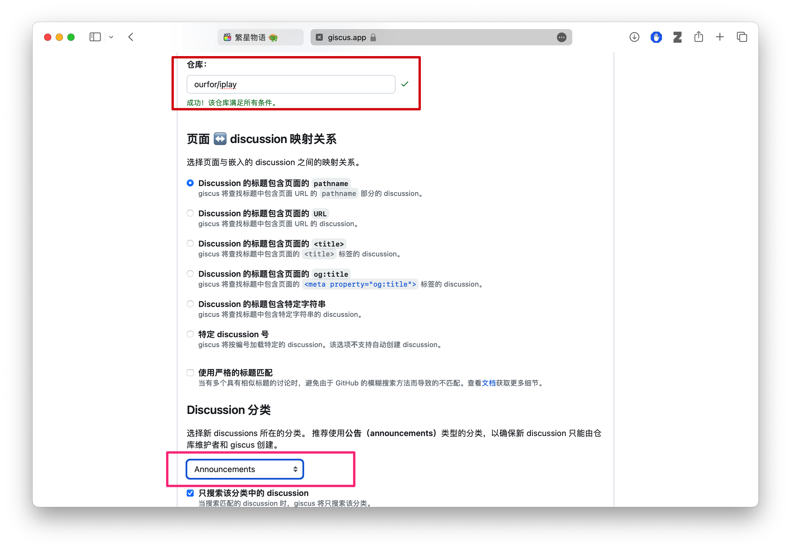
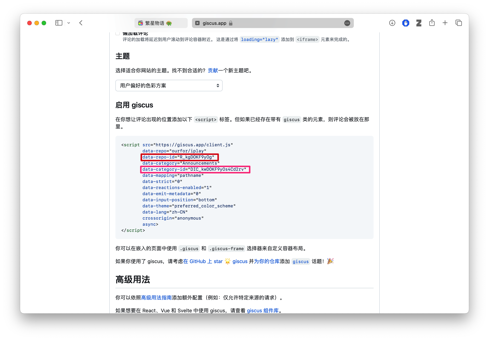

### 配置Giscus评论功能

在`.env.production`文件中，根据需要配置如下环境变量值
```env
REACT_APP_GISCUS_ENABLED=true
REACT_APP_GISCUS_REPO=ourfor/iplay
REACT_APP_GISCUS_REPO_ID=R_kgDOKF9yOg
REACT_APP_GISCUS_CATEGORY=Announcements
REACT_APP_GISCUS_CATEGORY_ID=DIC_kwDOKF9yOs4Cd2rv
REACT_APP_GISCUS_MAPPING=pathname
REACT_APP_GISCUS_STRICT=0
REACT_APP_GISCUS_REACTIONS_ENABLED=1
REACT_APP_GISCUS_EMIT_METADATA=0
REACT_APP_GISCUS_INPUT_POSITION=top
REACT_APP_GISCUS_THEME=dark
REACT_APP_GISCUS_LANG=zh-CN
REACT_APP_GISCUS_LOADING=lazy
```

其中`REPO_ID`和`CATEGORY_ID`需要根据在[giscus](https://giscus.app/zh-CN)中填写对应`REPO`后复制



根据生成的内容修改

