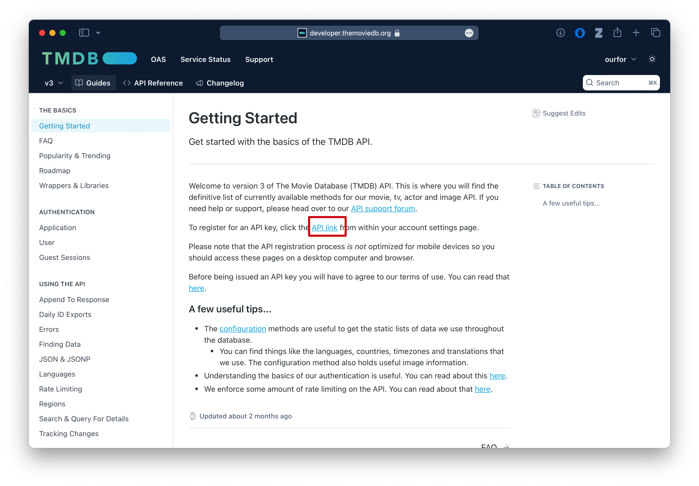
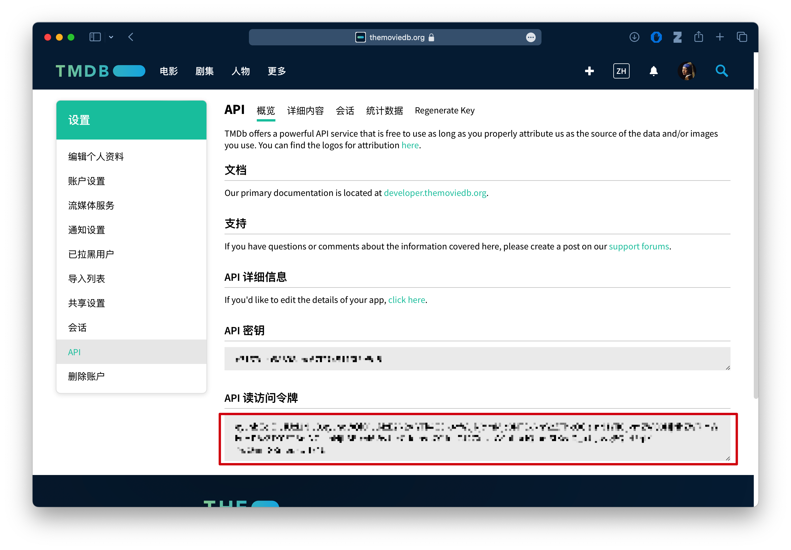

### 制作演示站点

clone仓库代码，安装[deno](https://deno.com), 

```bash
curl -fsSL https://deno.land/install.sh | sh
```

然后复制`.env.example`为`.env`

修改`.env`里面的***TMDB_TOKEN***为TMDB提供的读凭证





然后运行:
```bash
deno run --allow-all tools/top-tv.ts
deno run --allow-all tools/top-movie.ts
```

会在`dist`目录下面生成视频资源，没有视频播放资源